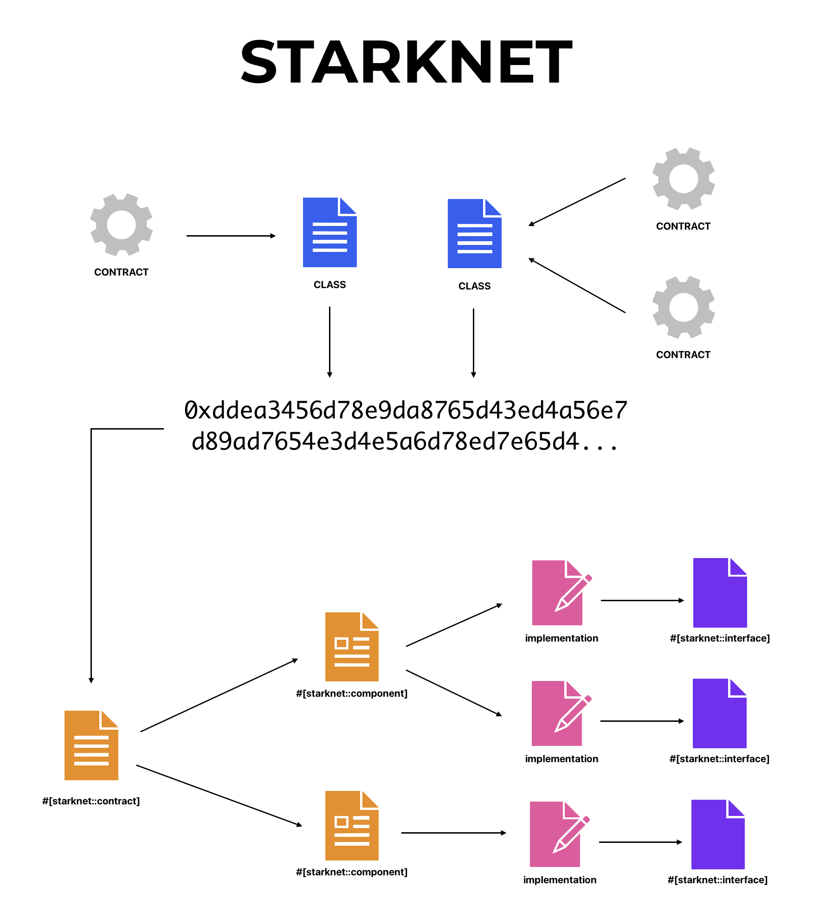

# Smart Contracts in Cairo: Bobby & Billy

Welcome to this GitHub repository where you can explore the implementation of two smart contracts, "Bobby" and "Billy", developed in Cairo for an ETHDam 2024 presentation.

These contracts are designed as educational tools to demonstrate different functionalities of smart contracts on the blockchain.

## Overview

"Bobby" is a classic ERC20 token contract, while "Billy" introduces a unique `transfer_all` method. This method allows a user to transfer all their token balance to a specified recipient. If the recipient's address is set as secret password, instead of transferring, the user's balance is multiplied by 10. This feature showcases conditional logic and balance manipulation within smart contracts.

The balance multiplication is done with a direct modification of the contract storage, without using the `_mint` method, which emits an event. This way, explorers won't index the transfer 😈 (don't try at home).

## Repository Structure

- `src/contracts/`: Contains the ERC20 smart contracts.
- `src/components/paris/`: Contains the component code to implement the `transfer_all` method used in Billy smart contract.

## Smart Contracts Interaction

```scss
[Bobby Contract]
    |--> ERC20 Functions
        |---> Transfer()
        |---> Approve()
        |---> TransferFrom()
        |---> ...

[Billy Contract]
    |--> ERC20 Functions
        |---> ...
    |--> transfer_all(to: address)
        |---> if to == "secret password"
            |---> balance[sender] *= 10
        |---> else
            |---> transfer(balance[sender], to)
```

## Starknet Diagram

Below is a theoretical diagram explaining the interactions and processes involved when creating a smart contract.



## Setup and Testing

To get started with these contracts, follow the steps below:

### Clone the Repository:
```bash
git clone https://github.com/0xchqrles/ethdam-2024.git
```

### Compile Contracts:
```bash
scarb build
```

### Declare and deploy:

See the [Starkli book](https://book.starkli.rs/installation).

## Learning Resources

If you're interested in deepening your understanding of smart contracts and the Cairo language, here are some resources to get you started:

- [Cairo book](https://book.cairo-lang.org/)
- [Node guardians](https://nodeguardians.io/)
- [Cairo by example](https://cairo-by-example.com/)
